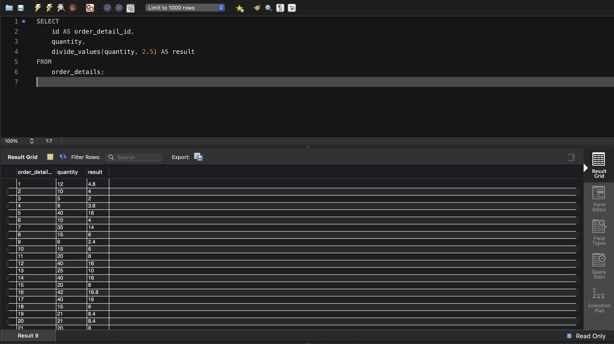

### Завдання 1
Напишіть SQL запит, який буде відображати таблицю order_details та поле customer_id з таблиці orders відповідно для кожного поля запису з таблиці order_details.

Це має бути зроблено за допомогою вкладеного запиту в операторі SELECT.
```sql
SELECT 
    order_details.*,
    (SELECT customer_id 
     FROM orders 
     WHERE orders.id = order_details.order_id) AS customer_id
FROM order_details;
```


### Завдання 2
Напишіть SQL запит, який буде відображати таблицю order_details. Відфільтруйте результати так, щоб відповідний запис із таблиці orders виконував умову shipper_id=3.

Це має бути зроблено за допомогою вкладеного запиту в операторі WHERE.
```sql
SELECT *
FROM order_details
WHERE order_id IN (
    SELECT id
    FROM orders
    WHERE shipper_id = 3
);
```


### Завдання 3
Напишіть SQL запит, вкладений в операторі FROM, який буде обирати рядки з умовою quantity>10 з таблиці order_details. Для отриманих даних знайдіть середнє значення поля quantity — групувати слід за order_id.
```sql
SELECT 
    subquery.order_id,
    AVG(subquery.quantity) AS avg_quantity
FROM (
    SELECT order_id, quantity
    FROM order_details
    WHERE quantity > 10
) AS subquery
GROUP BY subquery.order_id;
```


### Завдання 4
Розв’яжіть завдання 3, використовуючи оператор WITH для створення тимчасової таблиці temp. Якщо ваша версія MySQL більш рання, ніж 8.0, створіть цей запит за аналогією до того, як це зроблено в конспекті.
```sql
WITH temp AS (
    SELECT order_id, quantity
    FROM order_details
    WHERE quantity > 10
)
SELECT 
    temp.order_id,
    AVG(temp.quantity) AS avg_quantity
FROM temp
GROUP BY temp.order_id;
```


### Завдання 5
Створіть функцію з двома параметрами, яка буде ділити перший параметр на другий. Обидва параметри та значення, що повертається, повинні мати тип FLOAT.

Використайте конструкцію DROP FUNCTION IF EXISTS. Застосуйте функцію до атрибута quantity таблиці order_details . Другим параметром може бути довільне число на ваш розсуд.

```sql
DELIMITER $$

DROP FUNCTION IF EXISTS divide_values$$

CREATE FUNCTION divide_values(dividend FLOAT, divisor FLOAT) 
RETURNS FLOAT
DETERMINISTIC
BEGIN
    IF divisor = 0 THEN
        RETURN NULL; -- Уникаємо ділення на нуль
    END IF;
    RETURN dividend / divisor;
END$$

DELIMITER ;
```

```sql
SELECT 
    id AS order_detail_id,
    quantity,
    divide_values(quantity, 2.5) AS result
FROM 
    order_details;
```


